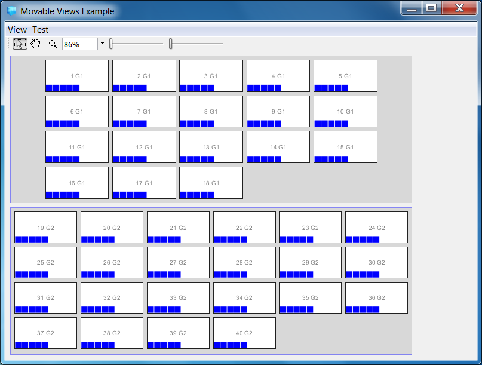
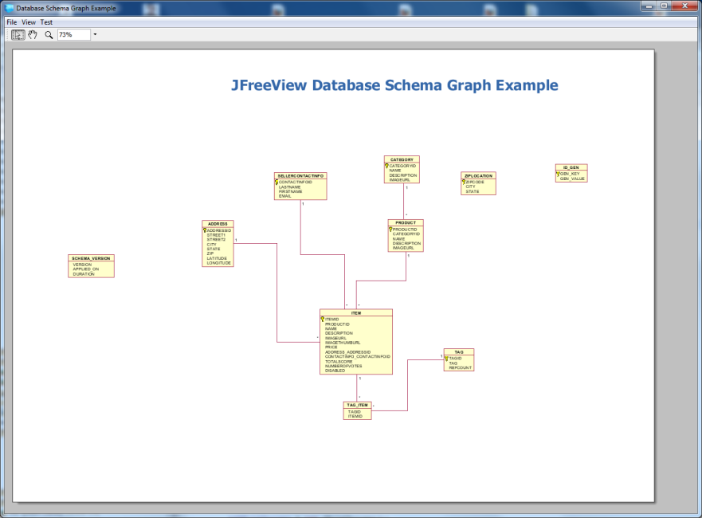
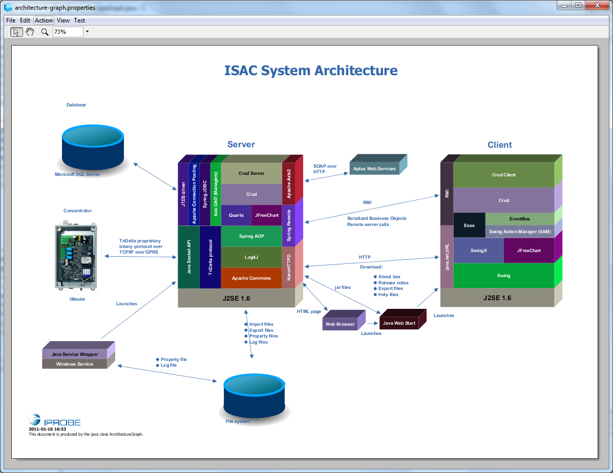
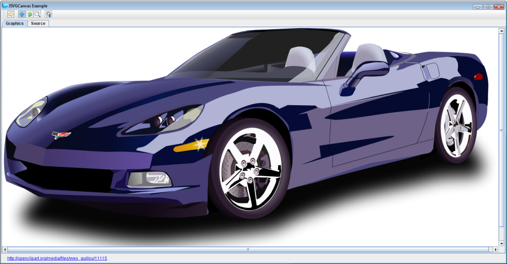

=  JFreeView
:toc: left
:icons: font
:sectnums:

JFreeView is a framework based on Java Swing and Java2D for visualizing and editing various kinds of models. The central objects
are views that render them selfs on a JPanel. Views can be moved and resized by connected handles.

== Use the library in your code
There are three different components you can use from the JFreeView project.

. `se.bluebrim.view`
+
This component contains a 2D scene graph that can be used when implementing a graphical application in Swing. To use it include the
following in your pom.xml:
+
----
se.bluebrim:se.bluebrim.view:1.x.x
----
+
`se.bluebrim.view.example.movableviews` contains an example how this component can be used.
+
. `se.bluebrim.desktop.application`
Use this component to develop a multi document desktop application in Java Swing. You just have to create four classes to get
the whole thing running:
+
.. `YourDesktopApp` extending `se.bluebrim.desktop.DesktopApp`
.. `YourFileEditor` extending `se.bluebrim.desktop.FileEditor`
.. `YourModel` extending `se.bluebrim.crud.esox.DirtyPredicateModel`
.. `YourPanel` extending `se.bluebrim.crud.client.DirtyPredicatePanel`
+
Have a look at `se.bluebrim.desktop.application.example.jdbc` to se how this is done.
+
To use the component include the following in your pom.xml:
+
[source,xml]
----
<dependency>
    <groupId>se.bluebrim</groupId>
    <artifactId>se.bluebrim.desktop.application</artifactId>
    <version>1.x.x</version>
</dependency>
----
+
. `se.bluebrim.desktop.application.graphical`
A component that extends `se.bluebrim.desktop.application` with functions for creating a graphical desktop application using
the `se.bluebrim.view` component. Adds also functions for saving in the pdf and svg formats. The only difference from using the
`se.bluebrim.desktop.application` component is that you subclass `se.bluebrim.desktop.graphical.GraphicalFileEditor` instead of
`se.bluebrim.desktop.FileEditor`.
+
You can study the `se.bluebrim.view.example.architecturegraph` example to see how this is done.
+
To use the component include the following in your pom.xml:
+
[source,xml]
----
<dependency>
<groupId>se.bluebrim</groupId>
<artifactId>se.bluebrim.desktop.application.graphical</artifactId>
<version>1.x.x</version>
</dependency>
----

== Try examples

=== Movable Views Example
This application show many features of the JFreeView library.
Run class: `se.bluebrim.view.example.movableviews.MovableViewsExample`

=== Database Schema Graph Example
Reads the meta data from a database and creates a graph of the tables and the foreign key relations. This demo uses an embedded memory
based HSQLDB containing a simple Pet Store database model.

Run class: `se.bluebrim.view.example.dbschemagraph.SchemaGraphBuilder`

=== Architecture Graph Example
The `ArchitectureGraph` class that can be run by checking out the source code in your IDE. The class creates an example of an
architecture graph. The blocks in the graph are created programmatically and the layout of the blocks are handled by Swing layout
managers. The position of the blocks and additional graphic elements that are created from resources files can be manually adjusted in
the GUI by dragging around the elements. The resulting layout is saved in a properties file.

Run class: `se.bluebrim.view.example.architecturegraph.ArchitectureGraph`

The graph is inspired by JavaSE architecture graph.

=== JSVGCanvas Example
The example is a desktop application with one single JSVGCanvas browsing a series of SVG-files
The icons for the tool bar was found at: http://www.iconfinder.net[] The purpose for the class is to demonstrate
how to include SVG graphics into Swing components. It's not obvious how this is done with the Batik framework.

Run class:
`se.bluebrim.example.svgcanvas.SVGCanvasExample`

'''
++++
<small>

Project logo from <a href="http://www.psdgraphics.com">http://www.psdgraphics.com</a>

</small>
++++
